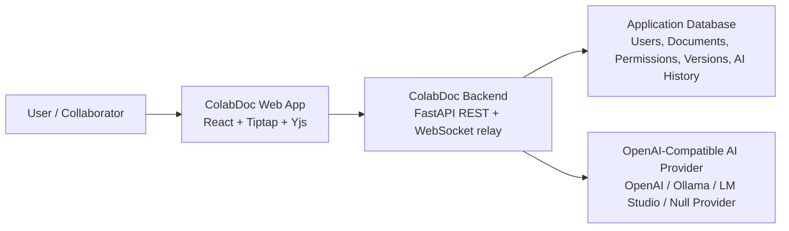
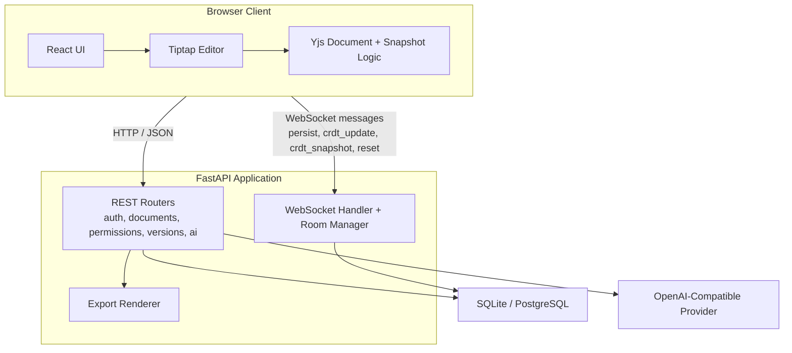
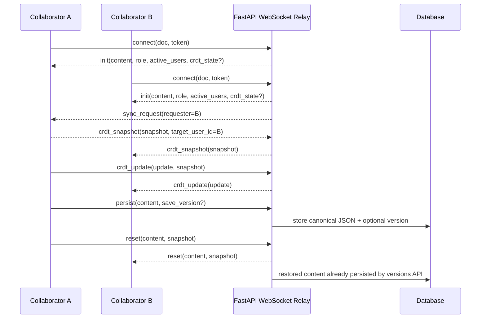

# Architecture Addendum

This addendum documents the architecture that is actually shipped in the final
Assignment 2 submission. It exists to remove ambiguity between the earlier
Assignment 1 design report and the delivered codebase.

Use this file together with [README.md](README.md) and [DEVIATIONS.md](DEVIATIONS.md) as the authoritative description of the final system.

## Final Stack

- Frontend: React + Vite + Tiptap
- Realtime editing: Yjs in the browser over authenticated WebSockets
- Backend: FastAPI + SQLAlchemy
- Database: SQLite for zero-config local review, PostgreSQL-compatible in production
- Authentication: app-managed registration/login with JWT access + refresh tokens
- AI: OpenAI-compatible provider abstraction with local/test fallback

## System Context

Key clarification:
- Authentication is handled by the ColabDoc backend itself. There is no external Auth0-style identity provider in the shipped PoC.

## Container View

## Collaboration Flow

Why this matters:
- Live collaboration now merges concurrent connected edits through Yjs instead of replacing the whole document on every keystroke.
- The backend still persists canonical rich-text JSON for export, AI context, version history, and reviewer inspection.

## Repository Layout

The final submission is intentionally a single repository:

- `backend/`: FastAPI app, models, routers, AI providers, export logic
- `frontend/`: React UI, Tiptap editor, Yjs collaboration logic, tests
- `tests/`: backend pytest suite
- root docs: `README.md`, `DEVIATIONS.md`, this addendum

This is a deliberate simplification for reviewer setup and demo reliability. It is not pretending to be a multi-repo deployment.

## Assignment 1 Feedback Resolution

This section maps the previous feedback to the final submission state.

### Authentication provider omitted from diagrams

Resolved by:
- explicitly documenting backend-managed JWT auth in this addendum and `DEVIATIONS.md`
- showing auth inside the backend rather than implying an external provider

### Long-running AI handled synchronously

Resolved by:
- streamed AI endpoint and progressive frontend rendering
- cancellation handling
- document-level AI history and resolution logging

### Repository structure mismatched the documented monorepo layout

Resolved by:
- explicitly documenting the real final layout above
- keeping setup and run flow aligned with the shipped repo root

### Report mismatched delivered auth / realtime stack

Resolved by:
- `DEVIATIONS.md` for intentional architecture changes
- this addendum for the actual final runtime architecture
- updated README protocol documentation for the shipped WebSocket flow

### README exposed secrets

Resolved by:
- using `.env.example` as the template
- generating a local JWT secret on first `start.sh`
- keeping real local values in `.env`, not documentation

### Missing automated tests

Resolved by:
- backend pytest suite for auth, documents, permissions, versions, AI, WebSockets
- frontend vitest suite for login, editor bar, AI panels, and collaboration rendering

## Remaining Trade-Offs

These are still deliberate simplifications, not silent omissions:

- The backend stores the latest room snapshot in memory rather than running a dedicated multi-instance Yjs persistence service.
- Refresh tokens remain stateless instead of using a revocation list.
- External email and object storage integrations from the Assignment 1 design are not part of the Assignment 2 PoC.

Those choices are documented so the grader can distinguish intentional scope reduction from accidental mismatch.
