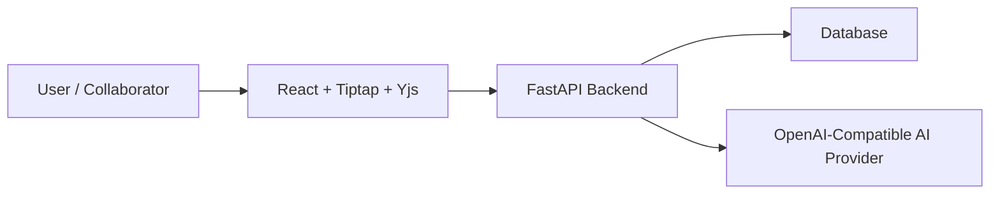

# Assignment 2 Report

## Project

**Title:** ColabDoc  
**Repository:** [blackeyh/colabdoc](https://github.com/blackeyh/colabdoc)  
**Final submission branch:** `main`  

This document is a consolidated Assignment 2 submission report for ColabDoc.
It summarizes the final implementation, architecture, key deviations from the
Assignment 1 design, testing, and demo guidance in one place.

For deeper technical detail, see:
- `README.md`
- `DEVIATIONS.md`
- `ARCHITECTURE_ADDENDUM.md`
- `DEMO_CHECKLIST.md`

## Executive Summary

ColabDoc is a collaborative document editor with:

- user registration and login
- JWT-based protected access with refresh tokens
- rich-text document editing
- role-based sharing (`owner`, `editor`, `commenter`, `viewer`)
- real-time collaboration over authenticated WebSockets
- Yjs-backed concurrent editing with presence, typing, and remote cursor display
- streamed AI assistance with accept/edit/reject flow
- document-level AI history and audit trail
- version history and restore
- export to HTML and plain text

The final Assignment 2 version focuses on a reviewer-friendly local setup and a
strong live-demo path while explicitly documenting the places where the shipped
system differs from the broader production-style architecture proposed earlier.

## Final Tech Stack

- Frontend: React + Vite
- Editor: Tiptap / ProseMirror
- Realtime collaboration: Yjs over authenticated WebSockets
- Backend: FastAPI + SQLAlchemy
- Database: SQLite for local review, PostgreSQL-compatible in deployment
- Authentication: app-managed JWT access and refresh tokens
- AI: OpenAI-compatible provider abstraction with a deterministic local/test fallback

## Implemented Assignment 2 Features

### 1. Authentication and Protected Access

- registration and login are implemented
- passwords are stored using secure hashing
- authenticated API access uses JWT bearer tokens
- refresh tokens are supported through `/auth/refresh`
- protected routes and protected document access are enforced server-side

### 2. Document Management

- users can create, rename, load, edit, and delete documents
- rich-text editing supports headings, bold, italic, lists, and code blocks
- document content is stored in structured JSON
- legacy text-only content is still supported through a compatibility layer

### 3. Sharing and Role-Based Authorization

The final system supports four roles:

- `owner`
- `editor`
- `commenter`
- `viewer`

Behavior is enforced both in the UI and in backend routes.

- owners manage permissions
- editors can modify document content and use AI
- commenters can read but cannot edit document text or invoke AI
- viewers can read and export but cannot edit or invoke AI

### 4. Real-Time Collaboration

The final implementation uses Yjs in the frontend editor and FastAPI as the
authenticated relay layer.

Implemented collaboration behavior includes:

- real-time shared editing
- presence of active collaborators
- typing indicators
- in-editor collaborator cursor/caret rendering
- in-editor remote selection highlighting
- reconnect and late-join synchronization through room snapshots
- synchronized reset behavior after version restore

This replaces the older last-write-wins full-document approach and brings the
submission much closer to the intended Assignment 1 collaboration model.

### 5. AI Assistant

The AI assistant supports:

- streamed responses
- progressive rendering during generation
- cancellation during streaming
- compare before apply
- accept
- accept edited
- reject
- role-based access control
- document-level AI history
- logging of selected text, prompt, provider, model, output, status, and user action

The final demo path also explicitly includes proving that accepted AI text can
be undone through the editor history.

### 6. Version History

- versions can be saved
- version history can be listed
- a previous version can be restored
- restoring a version updates the live collaboration state for connected users

### 7. Export

The final system exports documents as:

- HTML
- plain text

This provides at least one portable format while keeping the export feature
deterministic, lightweight, and easy to review.

## Architecture Summary

The shipped system is intentionally simpler than a production multi-service
deployment, but it is fully documented and internally consistent.

Key architectural decisions:

- authentication is handled by the backend itself, not an external identity provider
- collaboration uses Yjs in the browser and a lightweight FastAPI WebSocket relay
- the backend persists canonical document JSON for versions, export, and AI context
- AI is provider-agnostic and can run with a real provider or a local deterministic fallback

## Deviations from Assignment 1 Design

The Assignment 1 report described a broader, more production-style architecture.
The final Assignment 2 submission intentionally simplifies that design in ways
that are now explicitly documented.

Main documented deviations:

- local JWT auth instead of Auth0
- single-repo structure instead of a more distributed service layout
- lightweight FastAPI realtime relay instead of Redis-backed dedicated realtime infrastructure
- no external email service in the PoC
- no external file-storage service in the PoC
- HTML/TXT export instead of binary office document generation
- local SQLite default for reviewer setup

These are documented in:

- `DEVIATIONS.md`
- `ARCHITECTURE_ADDENDUM.md`

This was done deliberately to avoid silent mismatch between report and implementation.

## Setup and Reviewer Experience

The repository is designed so a reviewer can:

1. clone the repository
2. run `./start.sh`
3. open the application locally

The startup script:

- creates the Python virtual environment if needed
- installs backend dependencies
- installs frontend dependencies
- creates `.env` from `.env.example` if needed
- generates a local JWT secret on first run
- builds the frontend
- starts the backend server

This was added specifically to reduce setup friction during grading.

## Testing and Verification

The project includes both backend and frontend automated tests.

### Backend

- `pytest`
- current verified count: `66` passing tests

Coverage includes:

- auth
- documents
- permissions
- versions
- AI
- WebSockets
- submission-style integration rehearsal

### Frontend

- `vitest`
- current verified count: `20` passing tests

Coverage includes:

- login flow
- editor bar
- AI panel
- AI history panel
- remote cursor rendering
- Yjs collaboration merge behavior
- undo proof for accepted AI insertion

### Submission Rehearsal

The repository also includes:

- `tests/test_submission_rehearsal.py`

This test exercises a grading-style path through:

- login and refresh
- document creation
- sharing and roles
- collaboration messages
- AI streaming
- AI access control
- AI history
- export
- version restore

## Demo Readiness

The repository includes a dedicated demo script:

- `DEMO_CHECKLIST.md`

The recommended live demo order is:

1. authentication
2. document creation/editing
3. sharing and role enforcement
4. real-time collaboration
5. AI streaming and apply flow
6. AI role restrictions
7. version restore
8. export

This was added to reduce presentation risk and make the grading flow clearer.

## Remaining Trade-Offs

The final system is strong for the assignment, but some production-grade
concerns remain intentionally out of scope:

- tokens are stored in `localStorage`
- the backend keeps the latest room snapshot in memory rather than running a full multi-instance Yjs persistence service
- refresh tokens are stateless rather than revocation-backed
- the default local AI provider is deterministic unless a real provider is configured

These are documented rather than hidden.

## Conclusion

The final Assignment 2 submission delivers the required collaborative editor
functionality with a substantially stronger implementation than the earlier PoC:

- richer editor behavior
- real-time Yjs-backed collaboration
- streamed AI assistance
- role enforcement
- versioning
- export
- automated tests
- reviewer-friendly setup
- explicit architecture/deviation documentation

The repository now includes both detailed technical documentation and this
single-file summary report so the submission is easier to grade and defend.
