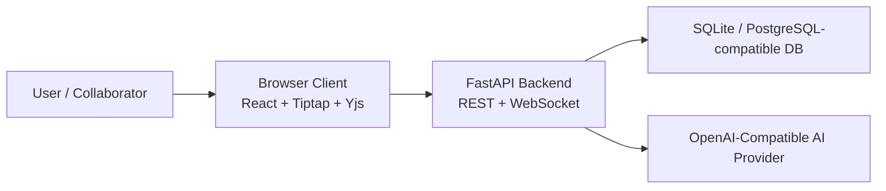

# Assignment 2 Detailed Submission Report

## 1. Submission Metadata

**Project:** ColabDoc  
**Repository:** [blackeyh/colabdoc](https://github.com/blackeyh/colabdoc)  
**Submission target branch:** `main`  
**Current working branch at report revision time:** `assignment-2`  
**Repository type:** single-repository full-stack web application  

This document is the detailed Assignment 2 report for the final ColabDoc
submission. It is intentionally more explicit than the short README summary so
that a grader can inspect one document and understand:

- what was implemented
- how the final system is structured
- how the implementation maps to the Assignment 2 requirements
- how the final codebase differs from the broader Assignment 1 design
- what was tested
- what trade-offs remain intentionally out of scope

Related project documentation:

- [README.md](README.md)
- [DEVIATIONS.md](DEVIATIONS.md)
- [ARCHITECTURE_ADDENDUM.md](ARCHITECTURE_ADDENDUM.md)

## 2. Project Summary

ColabDoc is a collaborative rich-text document editor that combines:

- application-managed authentication
- protected API routes
- document creation and editing
- role-based sharing
- real-time collaboration
- version history and restore
- streamed AI assistance
- export
- automated tests

The final Assignment 2 implementation is built to run locally with a single
command rather than depending on a larger production-style deployment. The
repository starts with `./start.sh`, uses SQLite by default for local review,
and keeps all required application logic inside a single repo. At the same
time, the project still implements the major behaviors expected by the
assignment:

- authenticated multi-user collaboration
- role enforcement for owners, editors, commenters, and viewers
- Yjs-backed concurrent editing with visible collaborator presence
- streamed AI suggestions with accept, edit, reject, and undo support
- version save and restore
- portable export
- docs and tests that match the shipped system

## 3. Final Technology Stack

### 3.1 Frontend

- React
- Vite
- Tiptap / ProseMirror
- Yjs
- native Fetch API with a thin `api.js` wrapper
- Vitest for frontend tests

### 3.2 Backend

- FastAPI
- SQLAlchemy ORM
- JWT-based authentication
- WebSockets for collaboration transport
- pytest for backend tests

### 3.3 Data and Infrastructure

- SQLite by default for local review
- PostgreSQL-compatible schema design
- local `.env` / `.env.example` configuration
- one-command startup through `start.sh`

### 3.4 AI Integration

- OpenAI-compatible provider abstraction
- streamed AI endpoint using `text/event-stream`
- deterministic null provider for local tests and no-network demos
- compatibility with local providers such as Ollama / LM Studio and hosted
  OpenAI-compatible endpoints

## 4. Assignment 2 Requirement Coverage

This section maps the final implementation to the expected Assignment 2
deliverables. The table is intentionally mechanical so a grader can move from a
requirement to its implementation artifact quickly.

| Requirement Area | Implemented Behavior | Exact Evidence / Artifact | Note / Limitation |
|---|---|---|---|
| Authentication | Registration, login, JWT access tokens, refresh endpoint | `backend/routers/auth.py`, `backend/auth.py`, `tests/test_auth.py` | App-managed JWT auth rather than an external identity provider |
| Protected access | Auth required for dashboard, documents, AI, versions, and collaboration | `backend/main.py`, `frontend/src/App.jsx`, `frontend/src/hooks/useWebSocket.js` | WebSocket auth uses a short-lived access token in the query string |
| Document management | Create, rename, load, delete, edit, and export documents | `backend/routers/documents.py`, dashboard components, `tests/test_documents.py` | Canonical document state is persisted as structured JSON |
| Rich-text editing | Headings, paragraphs, lists, code blocks, inline formatting, undo/redo | `frontend/src/components/editor/EditorTextarea.jsx`, `EditorBar.jsx` | Legacy plain-text documents are normalized through `contentCompat.js` |
| Sharing and roles | `owner`, `editor`, `commenter`, `viewer` with backend ACL enforcement | `backend/routers/permissions.py`, `backend/routers/documents.py`, `tests/test_permissions.py` | Four roles are kept; the brief required at least three |
| Realtime collaboration | Authenticated WebSockets, Yjs update relay, presence, remote carets, selections, typing | `backend/websocket_manager.py`, `backend/main.py`, `frontend/src/lib/collaboration.js`, `tests/test_websocket.py` | Latest room snapshot is cached in memory rather than persisted through a dedicated Yjs service |
| Conflict handling | Connected collaborators merge edits through Yjs rather than full-document overwrite | `frontend/src/components/editor/EditorTextarea.jsx`, `frontend/src/lib/collaboration.js` | Multi-instance backplane remains out of scope |
| AI assistant | Streamed suggestions, cancel, compare, accept, accept edited, reject | `backend/routers/ai.py`, `backend/ai/providers.py`, `frontend/src/components/editor/sidebar/AIPanel.jsx`, `tests/test_ai.py`, `frontend/tests/AIPanel.test.jsx` | Default local provider is deterministic unless a real provider is configured |
| AI access control | AI restricted to `editor` and `owner`; read-only roles blocked in UI and backend | `backend/routers/ai.py`, `frontend/src/components/editor/sidebar/AIPanel.jsx`, `frontend/src/components/editor/sidebar/AIHistoryPanel.jsx` | Read-only roles can still view document content and export |
| AI history and audit | Document-level audit trail with prompt, model, output, status, and user action | `backend/models.py`, `backend/routers/ai.py` | History is document-scoped, not only user-scoped |
| Version history | Save versions, list versions, restore previous state | `backend/routers/versions.py`, `frontend/src/components/editor/sidebar/VersionsPanel.jsx`, `tests/test_versions.py` | Restore is synchronized back into the collaboration room |
| Export | HTML and plain-text export from persisted content | `backend/exporters.py`, export endpoint in `backend/routers/documents.py`, `EditorBar.jsx` | Export targets readable portable formats rather than office binaries |
| API documentation | Interactive FastAPI docs and OpenAPI schema are exposed at `/docs` | `README.md`, FastAPI default `/docs`, router `summary=` and `response_model=` annotations in `backend/routers/auth.py`, `documents.py`, `permissions.py`, `versions.py`, `ai.py` | WebSocket behavior is documented in the README rather than OpenAPI |
| Setup and run script | `./start.sh` creates the environment, installs dependencies, builds the frontend, and starts the server | `start.sh`, `.env.example`, `README.md` | `npm install` currently runs on each startup; backend dependency install is stamp-based |
| Documentation | README, deviations report, architecture addendum, demo checklist, and this report | repo root docs | The docs describe the shipped PoC rather than a larger unimplemented architecture |
| Automated testing | backend pytest suite, frontend Vitest suite, submission rehearsal test | `tests/`, `frontend/tests/`, `tests/test_submission_rehearsal.py` | Counts are omitted here because they can change as tests evolve |

## 5. System Goals and Design Direction

The final submission balances three goals:

1. satisfy the Assignment 2 functional requirements
2. remain stable enough for a live course demo
3. clearly document where the shipped PoC is intentionally simpler than a
   production deployment

This design direction matters because the Assignment 1 feedback identified a
report-to-implementation mismatch. For Assignment 2, the final repo therefore
prioritizes consistency:

- the runtime architecture described in the docs is the architecture actually
  used by the code
- the setup path described in the docs is the path that works locally
- the collaboration model described in the docs matches the final Yjs-backed
  implementation
- the AI section no longer claims purely synchronous behavior; the shipped
  implementation is streamed and tested

## 6. Architecture Overview

### 6.1 High-Level Runtime View

The browser is responsible for:

- UI rendering
- editor state
- Yjs collaborative state
- token-based API access
- displaying AI output, history, versions, permissions, and presence

The backend is responsible for:

- authentication
- authorization
- document persistence
- sharing and permissions
- version persistence
- AI prompt creation and provider calls
- export generation
- WebSocket room management and message relay

### 6.2 Repository Layout

The final project is intentionally structured as a single repository:

- `backend/`
  - FastAPI application
  - SQLAlchemy models
  - routers for auth, documents, permissions, versions, and AI
  - AI provider abstraction
  - export rendering
  - WebSocket room manager
- `frontend/`
  - React application
  - Tiptap editor
  - Yjs collaboration logic
  - AI, permissions, version, and presence UI
  - frontend tests
- `tests/`
  - backend pytest suite
- root docs
  - README, deviations, architecture addendum, demo checklist, and this report

This is a deliberate simplification compared with a larger multi-service system.
It reduces local review friction and makes the final assignment easier to run
and inspect.

## 7. Backend Implementation

### 7.1 Entry Point and Application Wiring

`backend/main.py` is the FastAPI entry point. It is responsible for:

- creating the application object
- configuring CORS and middleware
- including the REST routers
- serving the built frontend
- exposing the authenticated WebSocket endpoint
- running lightweight startup schema checks for AI history columns

This makes `main.py` the integration layer where REST, WebSocket, frontend
static serving, and database initialization meet.

### 7.2 Authentication Layer

Authentication is implemented internally rather than through an external
identity provider.

Key backend modules:

- `backend/auth.py`
- `backend/routers/auth.py`

Implemented behavior:

- user registration
- password hashing
- login with access + refresh token issuance
- token-type validation
- token refresh
- dependency-based current-user lookup for protected endpoints

The final system uses:

- short-lived access tokens
- longer-lived refresh tokens
- token `type` claims to prevent using a refresh token where an access token is
  expected

This satisfies the assignment requirement for protected access while keeping the
entire auth flow demonstrable locally.

### 7.3 Document Management

Document CRUD is implemented through `backend/routers/documents.py`.

Supported operations include:

- create document
- list documents visible to the current user
- fetch a single document
- update title
- update content
- delete document
- export document

Documents are stored as structured JSON rather than plain text only. The final
editor uses the Tiptap / ProseMirror JSON document shape. To preserve
compatibility with earlier simple documents, the frontend contains a content
compatibility layer that can still read `{ "text": "..." }` style documents.

### 7.4 Sharing and Authorization

Sharing and permission management are handled primarily through:

- `backend/routers/permissions.py`
- permission checks inside `backend/routers/documents.py`
- permission checks inside `backend/routers/versions.py`
- permission checks inside `backend/routers/ai.py`

The shipped roles are:

- `owner`
- `editor`
- `commenter`
- `viewer`

Behavioral rules:

- `owner`
  - full control over the document
  - can manage collaborators
  - can edit, restore versions, invoke AI
- `editor`
  - can edit content
  - can invoke AI
  - can participate in live editing
- `commenter`
  - can read the document
  - cannot modify document text
  - cannot invoke AI
- `viewer`
  - can read the document
  - cannot edit
  - cannot invoke AI

The assignment asked for at least three roles; the project keeps four because
`commenter` already existed in the Assignment 1 code path and provides a clean
middle role between viewer and editor.

### 7.5 Version History

Versioning is implemented in `backend/routers/versions.py`.

Supported behavior:

- create a saved version
- list version history
- restore a previous version

When a restore occurs:

- the server persists the restored document content
- a realtime reset message is broadcast
- connected collaborators receive the restored state

This makes versions more than a static archive. They are integrated into the
active collaboration flow.

### 7.6 AI Subsystem

The AI subsystem is implemented through:

- `backend/routers/ai.py`
- `backend/ai/providers.py`
- `backend/ai/prompts.py`
- `backend/ai/context.py`

Backend responsibilities include:

- building the prompt from the selected text and surrounding document context
- truncating large context to stay within a practical prompt budget
- selecting the correct provider based on configuration
- streaming incremental output back to the frontend
- recording interaction metadata
- recording the final user decision after accept, edit, or reject

The provider abstraction currently supports:

- `OpenAIProvider`
  - compatible with hosted OpenAI-style APIs and local OpenAI-compatible servers
- `NullProvider`
  - deterministic fallback used for tests and offline local demos

### 7.7 Export Rendering

Export is implemented through:

- `backend/exporters.py`
- export endpoints in `backend/routers/documents.py`

Supported formats:

- HTML
- TXT

The HTML export preserves visible document structure such as:

- headings
- paragraphs
- ordered and unordered lists
- code blocks
- inline emphasis

The plain-text export produces a readable text version with paragraph spacing,
list bullets or numbering, and the title at the top.

### 7.8 WebSocket Room Management

Realtime collaboration is coordinated by:

- the WebSocket route in `backend/main.py`
- `backend/websocket_manager.py`

The backend WebSocket layer handles:

- authenticating the connecting user
- checking document access
- tracking active users per room
- relaying Yjs updates and snapshots
- relaying cursor and typing presence messages
- relaying version reset events
- caching the latest room snapshot in memory for late joiners

This is intentionally lightweight. It is strong enough for a course demo and
multi-user local testing without introducing a dedicated distributed
collaboration service.

## 8. Data Model and Persistence

The application database stores the durable state needed by the assignment.

### 8.1 Core Entities

| Entity | Purpose |
|---|---|
| `User` | registered user identity, credentials, and profile information |
| `Document` | title, current persisted content, owner, timestamps |
| `Permission` | role granted to a user for a specific document |
| `Version` | saved historical snapshot of a document |
| `AIInteraction` | document-level log of AI usage and user decisions |

### 8.2 Why This Data Split Matters

The project keeps two different categories of state:

1. durable business state in the database
2. active collaboration state in memory / browser Yjs documents

Durable state is used for:

- loading documents
- version history
- export
- AI context
- sharing and authorization
- audit history

Active collaboration state is used for:

- merging concurrent edits
- remote cursor updates
- typing indicators
- quick late-join synchronization

This split is important because it lets the app have modern collaborative
editing behavior while still keeping a clear canonical persisted document for
grading, restore, export, and AI.

## 9. Frontend Implementation

### 9.1 Application Structure

The frontend entry point is built around:

- `frontend/src/App.jsx`
- `frontend/src/main.jsx`

Key frontend areas:

- auth screens
  - `LoginPage.jsx`
  - `RegisterPage.jsx`
- dashboard
  - `Dashboard.jsx`
  - `NewDocModal.jsx`
- editor
  - `EditorPage.jsx`
  - `EditorBar.jsx`
  - `EditorTextarea.jsx`
- sidebar panels
  - AI
  - AI history
  - permissions
  - active users
  - versions

### 9.2 API Layer

`frontend/src/api.js` centralizes authenticated REST requests.

Responsibilities:

- storing access and refresh tokens
- attaching Bearer tokens to requests
- retrying requests once after a refresh
- updating stored tokens after refresh
- exposing helpers used by dashboard and editor components

This layer keeps token management out of individual UI components and gives the
app a single refresh strategy.

### 9.3 Dashboard Flow

The dashboard is the user landing area after authentication. It provides:

- document listing
- create document modal
- navigation into an editor page

This part of the UI demonstrates the assignment's basic authenticated app flow:

- unauthenticated users are redirected to login/register
- authenticated users see their own workspace
- the workspace includes documents they own or have access to

### 9.4 Editor Orchestration

`EditorPage.jsx` is the main orchestration component for a document session.

It coordinates:

- loading document data
- creating and configuring the WebSocket connection
- routing local editor changes into collaboration messages
- handling export
- handling version actions
- handling AI side panel state
- reacting to version restore resets

Because this component sits at the boundary between REST-loaded state,
WebSocket collaboration, and editor-local interaction, it is effectively the
runtime controller of the frontend.

### 9.5 Rich-Text Editor

`EditorTextarea.jsx` contains the Tiptap editor integration and the Yjs binding.

Implemented editor behavior includes:

- headings
- paragraphs
- bold / italic / inline code
- ordered and unordered lists
- code blocks
- undo / redo
- collaboration-aware editing
- collaborator caret and selection decorations

This file is central to the final assignment because it is where rich-text,
Yjs, presence, and undoability all meet.

### 9.6 Content Compatibility Layer

`frontend/src/lib/contentCompat.js` normalizes document content between:

- legacy plain-text shape
- final Tiptap JSON shape

This avoids breaking earlier documents and keeps the final editor compatible
with the older content format without requiring a destructive migration.

### 9.7 Sidebar Panels

The editor sidebar is separated into focused panels:

- `AIPanel.jsx`
- `AIHistoryPanel.jsx`
- `PermissionsPanel.jsx`
- `VersionsPanel.jsx`
- `ActiveUsers.jsx`

This separation improves clarity and testability:

- AI behavior can be tested independently
- permissions UI can evolve without changing the editor core
- history and version views are isolated from edit logic

## 10. Realtime Collaboration Design

### 10.1 Why Collaboration Changed

An earlier version of the project relied on broad full-document overwrite
messages. That approach is simple but weak under concurrent editing because the
last writer can overwrite another user's changes.

The final implementation improves this by using Yjs in the client editor. This
means that connected collaborators merge edits at the CRDT layer rather than
competing through whole-document replacement.

### 10.2 Collaboration Flow

The collaboration flow has four main layers:

1. authenticated room join
2. initial state or snapshot sync
3. incremental collaborative updates
4. durable content persistence

At room join:

- client connects with an access token
- server validates token and document access
- server sends initial metadata and current room state

During collaboration:

- Yjs incremental updates are exchanged
- the latest full snapshot is refreshed
- presence and cursor messages are broadcast

For persistence:

- the frontend still sends durable content to be stored as canonical JSON
- this persisted copy powers export, version history, and AI context

### 10.3 WebSocket Message Types

Server-to-client messages include:

- `init`
- `update`
- `crdt_update`
- `crdt_snapshot`
- `sync_request`
- `reset`
- `cursor`
- `typing`
- `user_joined`
- `user_left`

Client-to-server messages include:

- `update`
- `persist`
- `crdt_update`
- `crdt_snapshot`
- `sync_request`
- `reset`
- `cursor`
- `typing`

The `update` path remains for compatibility, but the important final path is the
CRDT-aware `crdt_update` and `crdt_snapshot` flow.

### 10.4 Presence and Visual Feedback

The final UI provides more than just shared text updates. It also shows:

- active collaborators
- typing indicator
- colored remote carets
- colored remote selection highlights

This matters in grading because it makes collaboration visible and easy to
demonstrate live instead of being hidden behind silent document changes.

### 10.5 Reconnect and Late Join

The backend caches the latest opaque room snapshot in memory. This allows:

- late joiners to bootstrap from current state
- reconnecting users to recover current collaboration state faster

This is not a full production Yjs persistence server, but it is a meaningful
improvement over earlier overwrite-only synchronization.

### 10.6 Version Restore During Collaboration

When a version is restored:

- the durable document content is replaced
- the collaboration room receives a reset broadcast
- connected clients refresh to the restored content

This is important because versioning would otherwise become disconnected from
the active collaborative editing session.

## 11. AI Assistant Design

### 11.1 Supported User Actions

The AI panel supports:

- rewrite
- summarize
- streamed generation
- cancel
- accept
- accept edited
- reject

The system never auto-applies AI output. A user must explicitly review and
choose what to do with the suggestion.

### 11.2 Streaming Model

The final AI flow is streaming rather than blocking.

The backend emits these event types over `text/event-stream`:

- `meta`
- `delta`
- `done`
- `error`

This allows the frontend to render partial output progressively rather than
waiting for the whole completion to finish.

### 11.3 Prompting Strategy

Prompts are selected by action from `backend/ai/prompts.py`.

The backend combines:

- selected text
- truncated surrounding document context
- action-specific instruction

This keeps prompts:

- reusable
- easy to inspect
- easy to extend with new actions later

### 11.4 Provider Abstraction

The provider layer was designed so the app does not depend on a single AI
vendor.

Benefits:

- local provider or hosted provider can be swapped with config
- tests can run without a live model
- the assignment can still be demonstrated if remote billing is unavailable

### 11.5 Access Control

AI usage is restricted to:

- `owner`
- `editor`

Read-only roles:

- `commenter`
- `viewer`

are blocked in two places:

1. frontend UI
2. backend route authorization

This prevents the UI from merely hiding a feature while leaving the server
vulnerable to direct requests.

### 11.6 AI History and Audit Trail

The final `ai_interactions` logging stores:

- selected text
- generated prompt
- provider name
- model name
- streamed/final suggestion
- provider status
- user action
- final applied text

This satisfies the requirement that AI use be inspectable after the fact rather
than existing only as an ephemeral UI event.

### 11.7 Accept, Edit, Reject, and Undo

The final implementation takes care to make AI editing safe:

- AI output is first shown in the panel
- accept applies the suggestion to the originally requested range
- accept edited applies the user's modified version
- reject records the decision without changing the document
- accepted AI text remains undoable through the editor history

The frontend suite includes
`frontend/tests/EditorTextarea.test.jsx`, specifically the test
`lets an accepted AI-style insertion be undone through collaboration history`.
That test calls `commands.undo()` after an AI-style insertion and verifies that
the editor returns to its earlier content. This was added because graders often
check whether AI-applied text behaves like a normal editor edit.

## 12. Setup and Reviewer Experience

### 12.1 Default Review Path

The intended reviewer path is:

1. clone the repo
2. run `./start.sh`
3. open `http://127.0.0.1:8000`

### 12.2 What `start.sh` Does

The startup script now:

- creates `.venv` if needed
- installs backend dependencies when needed
- installs frontend dependencies with `npm install`
- creates `.env` from `.env.example` when missing
- generates a local JWT secret on first-run config creation
- builds the frontend
- starts the backend server

This gives the project a single command local start path.

### 12.3 Default Configuration

`.env.example` is intentionally runnable locally.

Defaults include:

- SQLite database
- local JWT configuration
- AI null provider for offline demos/tests
- optional OpenAI-compatible provider fields for later switching to a real model

This means a grader can still inspect the full feature flow without being
blocked by cloud credentials.

### 12.4 API Documentation Surface

FastAPI exposes interactive API documentation at `/docs`. The generated docs are
not left as unnamed defaults: the REST routers use explicit `summary=`
annotations and `response_model=` declarations. Representative examples include:

- `backend/routers/auth.py`
  - register, login, refresh token exchange
- `backend/routers/documents.py`
  - list, create, fetch, export, update, delete
- `backend/routers/permissions.py`
  - list permissions, grant access, update role, revoke access
- `backend/routers/versions.py`
  - list versions, fetch one version, restore a version
- `backend/routers/ai.py`
  - request suggestion, stream suggestion, resolve decision, list history

This means the API is documented in two layers:

- FastAPI OpenAPI docs for the REST surface
- README documentation for the WebSocket collaboration protocol

## 13. Testing and Verification

### 13.1 Backend Test Coverage

The backend pytest suite currently verifies:

- authentication
- login and refresh
- document CRUD
- permission behavior
- version save and restore
- AI streaming and AI history behavior
- WebSocket room behavior
- submission-style end-to-end rehearsal

At the time of writing, the backend pytest suite passes locally.

Test files:

- `tests/test_auth.py`
- `tests/test_documents.py`
- `tests/test_permissions.py`
- `tests/test_versions.py`
- `tests/test_ai.py`
- `tests/test_ai_unit.py`
- `tests/test_websocket.py`
- `tests/test_submission_rehearsal.py`

### 13.2 Frontend Test Coverage

The frontend Vitest suite verifies:

- auth UI behavior
- editor bar actions
- AI panel behavior
- AI history panel behavior
- collaboration behavior
- remote cursor rendering
- AI-applied edit undoability

At the time of writing, the frontend Vitest suite passes locally.

This matters because several assignment requirements are UI-observable and need
frontend-level confidence, not only backend route tests.

### 13.3 Submission Rehearsal Test

The final repo includes `tests/test_submission_rehearsal.py`, which is a
grading-style integration path.

It exercises:

- register and login
- token refresh
- document creation
- sharing and role enforcement
- collaboration message flow
- AI streaming
- AI ACL
- AI history
- export
- version restore

This is especially useful because it packages the main rubric-relevant path
into one automated rehearsal rather than leaving the grade-critical flow
untested.

### 13.4 Frontend Undo Proof

Because AI insertion and collaboration history can interact in subtle ways, the
frontend suite includes a dedicated proof in
`frontend/tests/EditorTextarea.test.jsx`. The test name is
`lets an accepted AI-style insertion be undone through collaboration history`.
It applies an AI-style insertion, calls `commands.undo()`, and verifies the
editor returns to the earlier content.

## 14. Alignment With Assignment 1 Design

The Assignment 1 report described a broader architecture than the final PoC.
For Assignment 2, the important principle is no longer "match every production
integration exactly" but "ship a coherent system and document intentional
scope reductions clearly."

### 14.1 Preserved Ideas From Assignment 1

The final submission still preserves the key product-level ideas:

- collaborative editing
- permissions and sharing
- AI assistance
- version history
- export
- multi-user workflow
- clear architecture separation between frontend and backend

### 14.2 Deliberate Simplifications

The final submission intentionally simplifies:

- external identity provider usage
- email integration
- object storage integration
- dedicated multi-instance realtime backplane
- larger service decomposition

These simplifications are documented in `DEVIATIONS.md` and
`ARCHITECTURE_ADDENDUM.md` so they are explicit rather than hidden.

## 15. Resolution of Earlier Feedback

The Assignment 1 feedback identified several problems. This section explains
how the final Assignment 2 submission addresses each one.

### 15.1 Incomplete System Context Diagram

Earlier issue:

- authentication provider was omitted or unclear

Final resolution:

- the shipped architecture now explicitly documents backend-managed JWT auth
- system and container diagrams show authentication as part of the backend
- docs no longer imply an external provider that does not exist in the runtime

### 15.2 Long-Running AI Was Deferred to Synchronous Flows

Earlier issue:

- AI handling was not streamed and looked simplified relative to the report

Final resolution:

- streamed AI endpoint implemented
- frontend renders streamed partial output
- cancel behavior implemented
- partial failure handling improved
- AI history and resolution logging implemented

### 15.3 Repository Structure Did Not Match the Documented Layout

Earlier issue:

- the report described a structure that the repo did not actually follow

Final resolution:

- final docs explicitly describe the real single-repo structure
- root-level startup and documentation now match the shipped repo
- no hidden assumption of a bigger workspace remains

### 15.4 Auth / Realtime Stack Mismatched the Report

Earlier issue:

- report and implementation diverged

Final resolution:

- auth stack is now explicitly documented as local JWT auth
- realtime stack is documented as Yjs in browser plus FastAPI relay
- docs describe exactly what is persisted and what remains in memory

### 15.5 README Configuration Exposed Secrets

Earlier issue:

- configuration examples could leak real values or encourage insecure handling

Final resolution:

- `.env.example` is the documented template
- `.env` is local only
- `start.sh` generates a local JWT secret when auto-creating config

### 15.6 Missing Automated Tests

Earlier issue:

- not enough executable proof of behavior

Final resolution:

- backend pytest suite expanded across all major subsystems
- frontend suite added for UI-sensitive behaviors
- submission rehearsal test added
- AI undo proof added

## 16. Demo Checklist Reference

The repository includes a recommended live demo order. This section documents
that order; it is a presentation plan, not a claim that the grader has already
observed the demo.

Suggested order:

1. show login / protected access
2. create a document and add rich-text content
3. share it with editor, viewer, and commenter
4. show live collaboration between owner and editor
5. show remote caret / selection and typing feedback
6. invoke AI and let the output stream
7. accept or edit-accept a suggestion
8. undo the AI-applied change
9. open AI history
10. show that viewer/commenter cannot use AI
11. save a version and restore it
12. export as HTML and TXT

The recommended live demo order is listed above for presentation prep.

## 17. Remaining Trade-Offs and Known Limits

The project is strong for the assignment, but some production-grade concerns
remain intentionally outside the current scope.

### 17.1 Authentication Trade-Offs

- tokens are stored in `localStorage`
- refresh tokens are stateless rather than revocation-backed

These are reasonable for the assignment PoC, but a production system would
normally move refresh tokens into secure cookies and add revocation handling.

### 17.2 Collaboration Trade-Offs

- the backend caches only the latest room snapshot in memory
- there is no dedicated shared Yjs persistence service
- there is no horizontal multi-instance backplane

This is still a meaningful improvement over overwrite-only collaboration, but
it is not a full production collaboration backend.

### 17.3 AI Trade-Offs

- CI primarily validates the null provider rather than an external paid model
- a real model must be configured for the strongest live AI demo

The benefit is that the repo remains testable and demoable even without vendor
billing or cloud credentials.

### 17.4 Export Trade-Offs

- export supports HTML and TXT rather than office file generation

This still satisfies the portable-format requirement while staying lightweight,
deterministic, and easy to inspect.

## 18. Evidence Summary

The main evidence chain for this submission is:

- auth and protected access
  - implemented in `backend/routers/auth.py` and `backend/auth.py`
  - exercised by `tests/test_auth.py`
- sharing and roles
  - implemented in `backend/routers/permissions.py`
  - exercised by `tests/test_permissions.py`
- collaboration
  - implemented through `backend/websocket_manager.py`,
    `frontend/src/lib/collaboration.js`, and `EditorTextarea.jsx`
  - exercised by `tests/test_websocket.py`
- AI streaming and AI history
  - implemented in `backend/routers/ai.py`
  - exercised by `tests/test_ai.py`, `tests/test_ai_unit.py`, and
    `frontend/tests/AIPanel.test.jsx`
- AI undo integration
  - exercised by
    `frontend/tests/EditorTextarea.test.jsx`
- version restore
  - implemented in `backend/routers/versions.py`
  - exercised by `tests/test_versions.py`
- grade-style workflow rehearsal
  - exercised by `tests/test_submission_rehearsal.py`

## 19. Conclusion

ColabDoc's final Assignment 2 submission delivers a complete collaborative
editor experience with:

- authenticated multi-user access
- rich-text editing
- role-based sharing
- Yjs-backed realtime collaboration
- streamed AI assistance with audit history
- version history and restore
- export
- one-command local setup
- detailed documentation
- automated tests

The most important improvement over the earlier PoC is that the runtime
architecture, shipped documentation, and test artifacts now describe the same
system. That consistency is what this report is intended to show.
